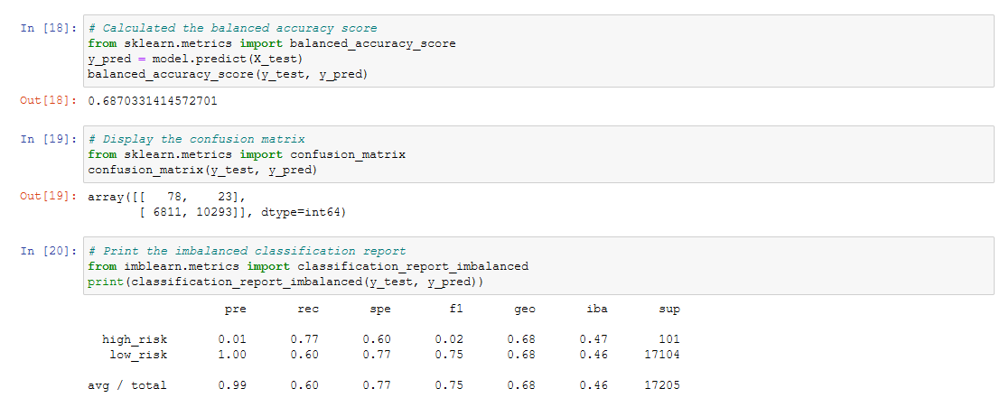
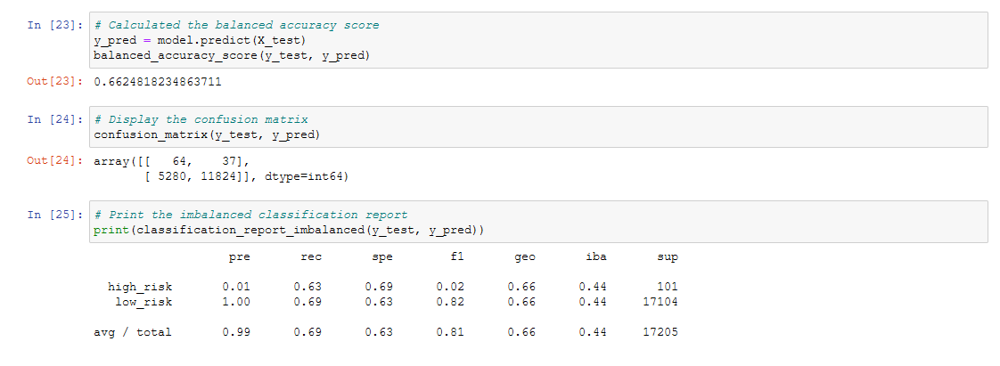
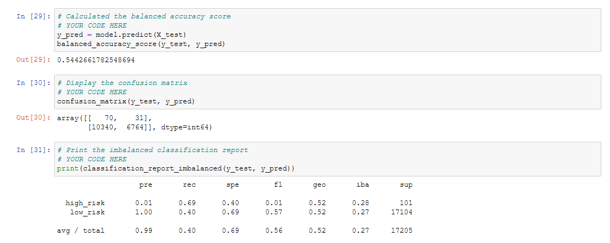
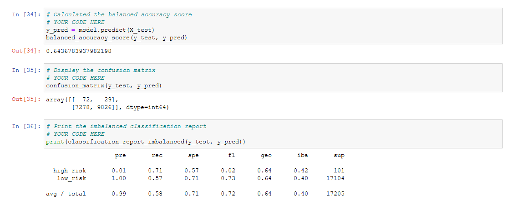
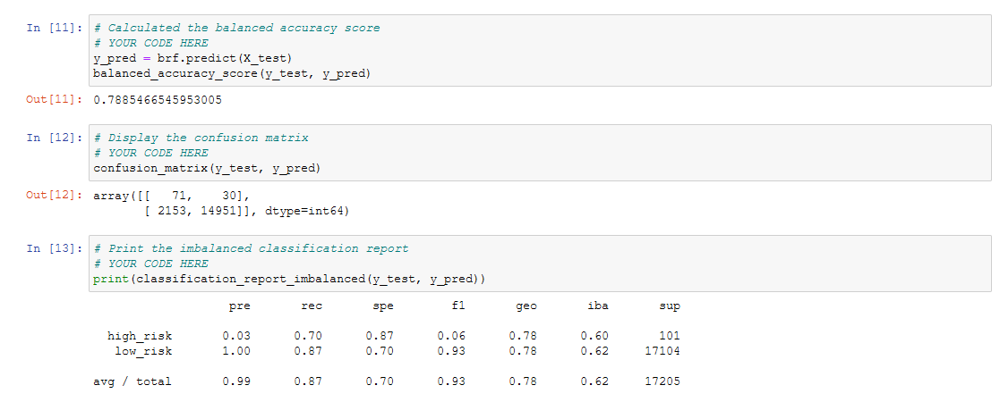
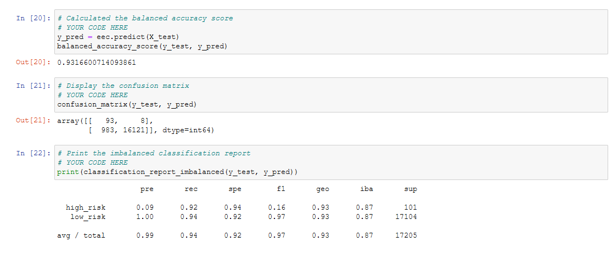

# Credit_Risk_Analysis
##	Overview of the analysis: 
1.	**Purpose:** An analysis of a supplied dataset was requested to evaluate the performance of six models for use in assessing credit risk. 
2.	**Discussion:** Two oversampling algorithms, naïve random oversampling, and synthetic minority oversampling technique (SMOTE), were evaluated along with one under sampling technique (Cluster Centroid algorithm) as well as a combination (over and under) sampling technique called SMOTEENN (that is, SMOTE mentioned previously combined with Edited Nearest Neighbor (ENN)).  Additionally, two ensemble learning algorithms were compared, a balanced random forest classifier and an “easy ensemble classifier” (an ensemble of AdaBoost (Adaptive Boosting) learners trained on different balanced bootstrap samples). (Note: a “bootstrap sample” is a smaller sample that is taken or “bootstrapped” from a larger sample.)
3.	**Scoring Methods:** Since the dataset by its nature was quite unbalanced (significantly more good credit scores than bad, a “balanced accuracy score” was calculated. Next, the “confusion matrix” was displayed.  Finally, a performance evaluation metric called a classification report was employed. Some of the metrics included in the report are precision (pre) or the ratio of true positives to the sum of true positives and false positives, recall (rec) or the ratio of true positives to the sum of true positives and false negatives, F1 score which is the harmonic mean of precision and recall, and support (sup) which is just the number of actual occurrences of each class in the dataset.   Because the dataset was imbalanced, the imbalanced classification technique was used.  (Note: In the report, three other metrics are included: specificity (spe) which is also known as the “true negative rate”, geometric mean (geo), and index balanced accuracy (iba).  A more detailed explanation of index imbalanced accuracy (as well as some of the other metrics mentioned here) can be found at: https://dev.to/amananandrai/performance-measures-for-imbalanced-classes-2ojj
 Note that while all the results are shown, only the balanced accuracy, precision, and recall scores will be discussed in the "Results" section. 	
##	Results: 
1.	Naïve Random Oversampling:  For the imblearn RandomOverSampler technique, the results are shown below:
 -	
 -	As can be seen above, the Naïve Random Oversampling technique had a balanced accuracy score of 0.69. It's precision (as well as the other three smapling techniques) was 1.00 for the low risk class (which represented the overwhelming majority of the data in the dataset) and 0.01 for the high risk class (which represented less than 1% of the instances in the dataset).  The recall was 0.77 for the high risk class and 0.60 for the low risk class.  The implication here is that 40% of the low risk candidates would be inaccurately tagged as high risk candidates.
2.	SMOTE:  For the imblearn SMOTE technique, the results are shown below:
 -	
 -	The SMOTE oversampling technique had a balanced accuracy score of 0.66, even poorer than the result for Naïve Random Oversampling. The recall for the high risk class was 0.63 and for the low risk class 0.69. 
3.	Cluster Centroid Algorithm:  For the imblearn ClusterCentroids technique, the results are shown below:
 -	
 -	The Cluster Centroid undersampling technique had a balanced accuracy score of 0.54, the poorest performance of all the techniques for this dataset. The recall was 0.69 for the high risk class and 0.40 for the low risk class.  In essence, more than 50% of the low risk class members would be incorrectly identified as high risk.
4.	SMOTEENN:   For the imblearn SMOTEENN technique, the results are shown below:
 -	
 -The SMOTEENN	combination over and undersampling technique yeilded a balanced accuracy score of 0.64, similar to the SMOTE ovesampling technique. The recall score was 0.71 for the high risk class and 0.57 for the low risk class. As mentioned previously, all of the sampling techniques had precision scores of 1.00 for the low risk class and 0.01 for the high risk class. (Indeed, all of the techniques including the ensemble classifiers had precision scores of 1.00 for the low risk class. However, the ensemble classifiers did somewhat better in their precision scores for the high risk class as will be shown.)
5.	Balanced Random Forest Classifier:   For the imblearn BalancedRandomForestClassifier technique, the results are shown below:
 -	
 -	The Balanced Random Forest Classifier ensemble technique produced a balanced accuracy score of 0.79, better than any of the sampling techniques. While the precision score for the low risk class was the same as all the other techniques, 1.00, the higk risk class showed a three-fold improvement of 0.03 which is nevertheless still very low. The recall for the high risk class was 0.71, similar to the SMOTEENN	technique, but the recall for the low risk class was 0.87, a considerable improvement over the four sampling techniques evaluated with this dataset.
6.	Easy Ensemble Classifier:  For the imblearn EasyEnsembleClassifier technique, the results are shown below:
 -	
 -	The Easy Ensemble Classifier ensemble technique had a balanced accuracy score of 0.93, the best score of all the techniques evaluated with this dataset. As already noted, this ensemble technique had the same precision for the low risk class as all of the other techniques evaluated at 1.00, but had the best (though still very low) precision of 0.09 for the high risk class. The recall for both classes was the best overall, with the high risk class coming in at 0.92 and the low risk class having even better score at a 0.94 recall value. 
##	Summary: 
1. Difficult Dataset: A dataset this imbalanced is potentially difficult for any supervised machine learning technique. The various sampling techniques struggled with the imbalance. The ensemble techniques seemed to handle the imbalance better, especially the EasyEnsembleClassifier technique.
2. Recommend the EasyEnsembleClassifier technique for similarly imbalanced datasets.  This technique performed the best overall.  
